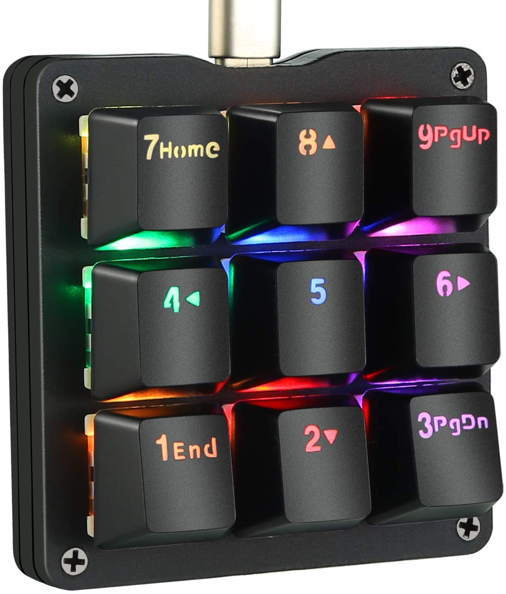

# Keyb

Control the angery keyboard.

Detected as a Winkeyless, but it's a clone. Sold on Amazon with the easy-to-remember name [One Handed Macro Mechanical Keyboard, Koolertron RGB LED Backlit Portable Mini One-Handed Mechanical Gaming Keypad OSU! Keyboard 9 Fully Programmable Keys Blue Switches ](https://www.amazon.co.uk/gp/product/B07WLC1WPH/).
```
[544493.520312] usb 3-4: new low-speed USB device number 73 using xhci_hcd
[544493.714480] usb 3-4: New USB device found, idVendor=20a0, idProduct=422d, bcdDevice= 1.04
[544493.714483] usb 3-4: New USB device strings: Mfr=1, Product=2, SerialNumber=0
[544493.714485] usb 3-4: Product: ps2avrGB
[544493.714486] usb 3-4: Manufacturer: winkeyless.kr
[544493.723712] input: winkeyless.kr ps2avrGB as /devices/pci0000:00/0000:00:14.0/usb3/3-4/3-4:1.0/0003:20A0:422D.006A/input/input235
[544493.780839] hid-generic 0003:20A0:422D.006A: input,hidraw0: USB HID v1.01 Keyboard [winkeyless.kr ps2avrGB] on usb-0000:00:14.0-4/input0
[544493.806732] input: winkeyless.kr ps2avrGB System Control as /devices/pci0000:00/0000:00:14.0/usb3/3-4/3-4:1.1/0003:20A0:422D.006B/input/input236
[544493.864636] input: winkeyless.kr ps2avrGB Consumer Control as /devices/pci0000:00/0000:00:14.0/usb3/3-4/3-4:1.1/0003:20A0:422D.006B/input/input237
[544493.865000] hid-generic 0003:20A0:422D.006B: input,hiddev0,hidraw1: USB HID v1.01 Device [winkeyless.kr ps2avrGB] on usb-0000:00:14.0-4/input1
```




## udev rules

```
cp udev-angerykeyb.rules /etc/udev/rules.d
udevadm trigger
```

## run

```
go run .
```
then press some keys on the 9-keys keyboard.
